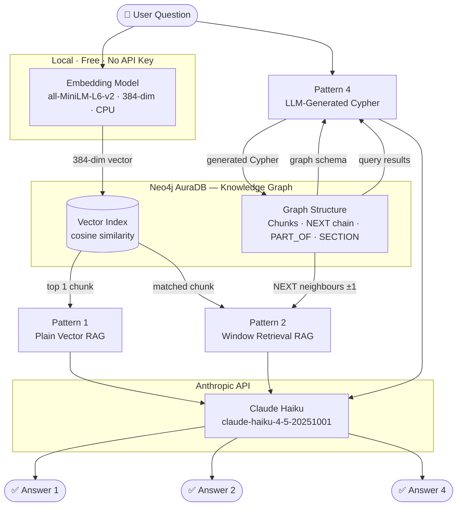
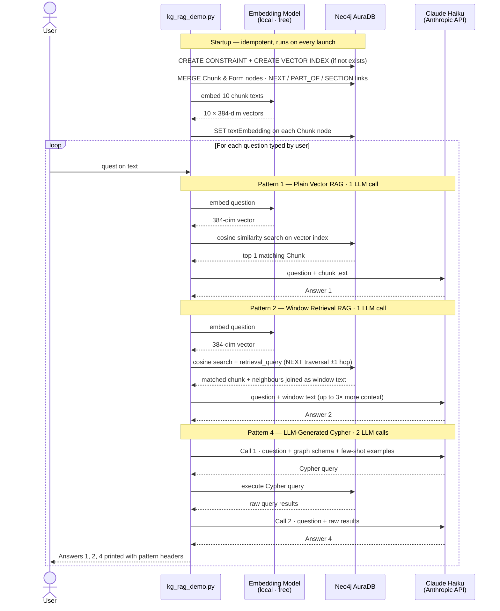
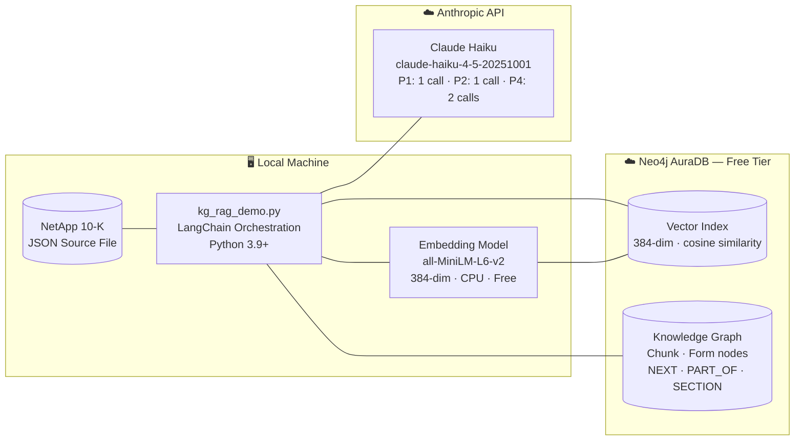

# Knowledge Graph RAG — Learning Demo

A hands-on learning project that demonstrates how combining a **Knowledge Graph** with **vector search** produces better answers than traditional RAG alone.

The project uses a real SEC Form 10-K filing (NetApp Inc.) as source data and runs three different retrieval strategies side-by-side so you can directly compare their outputs for the same question.

---

## What Problem Does This Solve?

Standard RAG (Retrieval-Augmented Generation) works by converting text into embeddings, storing them in a vector database, and retrieving the most "similar" chunk when a question is asked. This works well for simple factual questions — but breaks down for others:

| Question | Why Standard RAG Fails |
|---|---|
| "Give me a detailed overview of NetApp's strategy" | The answer spans multiple chunks; RAG only returns one |
| "How many text chunks does this filing have?" | The answer isn't in any chunk — it's a structural property of the data |

A Knowledge Graph fixes both problems: it stores **relationships** between chunks (ordering, document structure) that vector similarity cannot capture.

---

## What This Project Demonstrates

Three RAG patterns run for every question you ask, and their answers are printed side by side:

### Pattern 1 — Plain Vector RAG
Converts your question to an embedding, finds the most similar text chunk in Neo4j, and sends it to the LLM.

```
Question → Embedding → Cosine Similarity Search → Top Chunk → LLM → Answer
```

**Best for:** Simple, direct factual questions where the answer fits in one chunk.

---

### Pattern 2 — Window Retrieval RAG
Same vector search as Pattern 1, but then the graph is traversed to pull in the chunks immediately before and after the matched chunk (using `NEXT` relationships). The LLM receives up to 3× more context.

```
Question → Vector Search → Matched Chunk
                                ↓
                    Graph Traversal (NEXT links)
                    [Prev Chunk] + [Matched] + [Next Chunk]
                                ↓
                              LLM → Richer Answer
```

**Best for:** Broad questions where the answer spans across chunk boundaries.

---

### Pattern 4 — LLM-Generated Cypher
Instead of searching by similarity, the LLM is given the graph schema and asked to write a Cypher query. The query runs against Neo4j, and the raw results are sent back to the LLM to generate a natural-language answer.

```
Question → LLM writes Cypher → Neo4j executes Cypher → Results → LLM → Answer
```

**Best for:** Structural or counting questions whose answers do not exist in the text itself (e.g., "How many chunks are in this document?").

---

## Architecture

### Component & Data-Flow Diagram (Mermaid)



### Sequence Diagram (Mermaid)



### Deployment Architecture (Mermaid)

Shows what runs where — deployment boundaries, layers, and technology stack.



### Node & Relationship Map (ASCII)

```
                        ┌─────────────────────────────┐
                        │   NetApp SEC Form 10-K       │
                        │   (item1 — Business section) │
                        └──────────────┬──────────────┘
                                       │ split into 10 chunks
                                       ▼
┌──────────┐  NEXT  ┌──────────┐  NEXT  ┌──────────┐
│  Chunk 0 │───────▶│  Chunk 1 │───────▶│  Chunk 2 │  ...  (10 total)
│ text     │        │ text     │        │ text     │
│ embedding│        │ embedding│        │ embedding│
└────┬─────┘        └────┬─────┘        └────┬─────┘
     │ PART_OF           │ PART_OF           │ PART_OF
     └───────────────────┴───────────────────┘
                                 ▼
                          ┌────────────┐
                          │    Form    │
                          │  (10-K)    │
                          └────────────┘
                          Form ──SECTION──▶ Chunk 0  (entry point)
```

**How to read this diagram:**

- **Chunk nodes (horizontal chain):** The `item1` section of the 10-K is split into 10 overlapping text chunks. Each becomes a node in Neo4j storing two things — the raw `text` and its vector `embedding`. The `NEXT` arrows link them left-to-right in reading order. This is what a plain vector database cannot do: it finds *which chunk matched* your question, but has no idea what comes before or after it in the document. Pattern 2 uses these arrows to pull in neighbouring chunks.

- **PART_OF (vertical links down):** Every chunk has a `PART_OF` relationship pointing up to the single `Form` node. This is the "parent document" link — essential when the graph holds multiple filings, so queries can filter chunks by which document they belong to.

- **SECTION (Form → Chunk 0):** The `Form` node has a direct pointer to the first chunk of each section. This gives Pattern 4 (LLM-generated Cypher) a clean, named entry point: the LLM can write `MATCH (f:Form)-[:SECTION]->(c:Chunk)` to start reading a section from the top without knowing any internal chunk IDs.

| Relationship | Direction | Purpose |
|---|---|---|
| `NEXT` | Chunk → Chunk | Traverse sideways to expand context (Pattern 2) |
| `PART_OF` | Chunk → Form | Filter chunks by parent document |
| `SECTION` | Form → Chunk 0 | Named entry point into a section (Pattern 4) |

**Technology:**
| Component | Technology |
|---|---|
| Graph Database | Neo4j AuraDB (Free Tier) |
| Query Language | Cypher |
| LLM | Claude Haiku (`claude-haiku-4-5-20251001`) via Anthropic API |
| Embeddings | `all-MiniLM-L6-v2` — runs **locally**, no API cost |
| Orchestration | LangChain |

---

## Prerequisites

- Python 3.9 or later
- A free Neo4j AuraDB account — [console.neo4j.io](https://console.neo4j.io)
- An Anthropic API key — [console.anthropic.com](https://console.anthropic.com)
- 8 GB RAM is sufficient (the embedding model runs on CPU)

---

## Setup

### Step 1 — Create a Neo4j AuraDB Free Instance
1. Go to [console.neo4j.io](https://console.neo4j.io) and sign in (or create a free account)
2. Click **New Instance** → select the **Free** tier
3. Once created, note down your **Connection URI**, **Username**, and **Password**

### Step 2 — Get an Anthropic API Key
1. Go to [console.anthropic.com](https://console.anthropic.com)
2. Create an API key under **API Keys**
3. Claude Haiku costs approximately **$0.004–$0.005 per question** (all 3 patterns run per question; Pattern 4 makes 2 LLM calls) — very low cost for learning

### Step 3 — Fill in Your Credentials
Open the `.env` file in this folder and replace the placeholder values:

```
# Neo4j AuraDB Free Tier credentials (from console.neo4j.io)
NEO4J_URI=neo4j+s://xxxxxxxx.databases.neo4j.io
NEO4J_USERNAME=xxxxxxxx
NEO4J_PASSWORD=your-auradb-password-here
NEO4J_DATABASE=xxxxxxxx

# Anthropic API key (for Claude Haiku — used for all LLM calls)
ANTHROPIC_API_KEY=your-anthropic-api-key-here
```

### Step 4 — Install Dependencies
From this folder, run:

```bash
..\venv\Scripts\pip.exe install -r requirements.txt
```

This installs LangChain, the Neo4j driver, the Anthropic SDK, and the local embedding model.  
The embedding model (`all-MiniLM-L6-v2`) downloads automatically on first run (~22 MB).

---

## Running the Project

From inside the `KG-RAG-Project` folder:

```bash
..\venv\Scripts\python.exe kg_rag_demo.py
```

**What happens on first run:**
1. Creates 10 Chunk nodes + 1 Form node in Neo4j (with NEXT, PART_OF, SECTION relationships)
2. Generates embeddings locally for all 10 chunks — prints `✓ Embedded 10 chunks.`
3. Starts the interactive question loop

**What happens on every subsequent run:**
- The graph nodes already exist (MERGE is idempotent — no duplicates)
- Embeddings are already stored — prints `✓ Embeddings already populated — skipping.`
- Starts the interactive loop immediately, no extra cost incurred

---

## Try These Questions

Run the script and type each question to see the three patterns in action.

### Test 1 — When Pattern 1 is the best choice
```
Where is NetApp headquartered?
```
All three patterns answer correctly. Pattern 1 does it with just one chunk — proving that for simple factual lookups, plain vector RAG is fast and sufficient.

---

### Test 2 — When Pattern 2 outperforms Pattern 1
```
Give me a detailed overview of NetApp's business and cloud strategy
```
Pattern 1 answers from a single chunk — brief and incomplete.  
Pattern 2 expands via NEXT links to include neighbouring chunks — the answer is noticeably richer and more complete.

---

### Test 3 — When only Pattern 4 can answer
```
How many text chunks does this filing have?
```
Pattern 1 and Pattern 2 will say "I don't know" — because no chunk text ever says "there are 10 chunks."  
Pattern 4 generates and runs `MATCH (c:Chunk) RETURN count(c)` against the graph and returns the exact count.  
You can also see the generated Cypher printed in the terminal (thanks to `verbose=True`).

---

## Cost Summary

| Activity | Cost |
|---|---|
| Graph setup (first run) | **$0.00** — embeddings are local |
| Graph setup (re-runs) | **$0.00** — idempotent, nothing re-generated |
| Each question asked | ~**$0.004–$0.005** — 3 patterns run (Pattern 4 = 2 LLM calls) |
| 50 questions for learning | ~**$0.05** total |

---

## Files in This Project

| File | Purpose |
|---|---|
| `kg_rag_demo.py` | Main script — graph setup, embeddings, all 3 RAG chains, interactive loop |
| `0000950170-23-027948.json` | NetApp 10-K source data (read by the script at startup) |
| `.env` | Your credentials (never commit this to git) |
| `.env.example` | Credentials template — safe to commit to git |
| `requirements.txt` | Python dependencies |
| `README.md` | This file |

---

## Key Concepts Learned

| Concept | Where It Appears |
|---|---|
| Vector embeddings + cosine similarity | Pattern 1 — finding similar chunks |
| Graph relationships | Pattern 2 — NEXT links between chunks |
| Cypher query language | Pattern 2 retrieval query, Pattern 4 generated queries |
| Few-shot prompting | Pattern 4 — teaching the LLM Cypher patterns via examples |
| Idempotent data pipelines | `MERGE ... ON CREATE SET`, `IF NOT EXISTS`, `WHERE IS NULL` guards |
